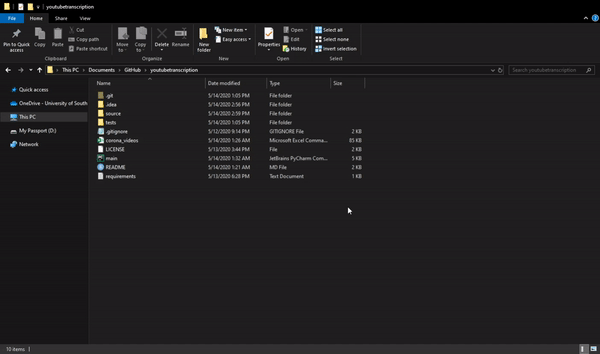

# YouTube Transcription

## Introduction
This repository houses a progam that can extract key details and the auto-generated transcriptions from youtube videos. It uses `BeautifulSoup` for the details and `youtube_transcript_api` for the transcriptions. (All which are found in the `requirements.txt`)

**Disclaimer: YouTube does not allow webscraping by their Terms of Service.**

> 3.) access the Service using any automated means (such as robots, botnets or scrapers) except (a) in the case of public search engines, in accordance with YouTube’s robots.txt file; or (b) with YouTube’s prior written permission; (https://www.youtube.com/static?template=terms)

This is purely for educational purposes and users should abide by YouTube Terms of Service.

## Tutorial
It's rather easy!

### Installing Requirements

Make sure that you have all the modules installed from the `requirements.txt`

To do this, open up the `youtubetranscription` folder in your command prompt.

Type the command `pip install -r requirements.txt`

If not running on windows navigate to the `youtubetranscription` folder in your console and type the same thing `pip install -r requirements.txt`
### Running the Program

 1) Run `main.py`
 1) Enter what you would like to search
 1) It will get the youtube videos from your search and download the different details of each video as well as the transcript into a csv file format.

## Other Information
### `youtubevideo` class

Each video is made into a `youtubevideo` class and has the following variables:
 * `url` (the video's URL)
 * `title` (title of video)
 * `description` (description of video)
 * `views` (number of views of video)
 * `published` (date of publication)
 * `likes` (likes of video)
 * `dislikes` (dislikes of video)
 * `channel_name` (name of channel)
 * `channel_url` (URL of channel from video)
 * `channel_subscribers` (number of subscribers)
 * `transcription` (auto-generated transcripts of video)

## Useful Links
https://python.gotrained.com/youtube-api-extracting-comments/

## References
Big shout-out to Abdou Rockikz for their post found: https://www.thepythoncode.com/article/get-youtube-data-python
